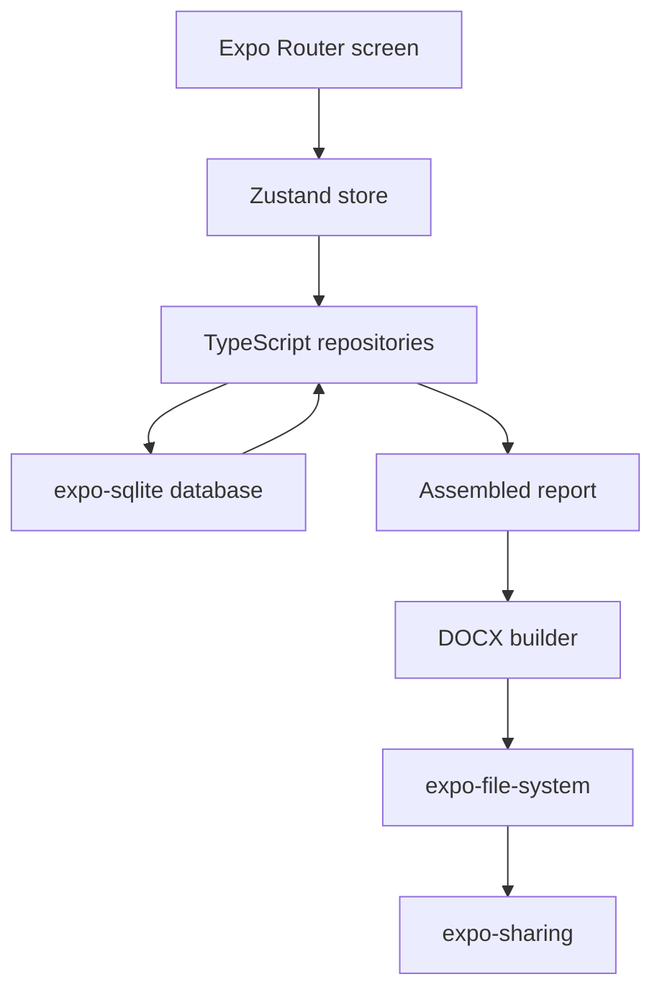

# Architecture

## Summary

The intended architecture is an offline-first mobile app with a thin UI layer, a local store, repository-backed persistence, and a report-assembly/export pipeline. In practice, the repository currently contains two architectures side by side: the active Expo runtime and a legacy Node-style in-memory model.

## Primary Runtime Flow

## Boot Sequence

1. `app/_layout.tsx` forces RTL and blocks rendering until boot completes.
2. `bootstrapDatabase()` initializes all declared SQLite tables.
3. `runSeeds()` inserts bundled Hebrew standards and finding templates when their tables are empty.
4. Expo Router mounts the screen stack after boot succeeds.

## Major Layers

### 1. Navigation and Screens

- File-based routing lives under `app/`
- Screens are responsible for layout, user input, and navigation
- Most screens either call the Zustand store or repository functions directly

### 2. State and Screen-Oriented Orchestration

- `src/store/projectsStore.ts` is the main app state container
- It handles project, area, finding, and image CRUD for the mobile flow
- The store is not comprehensive; some screens bypass it and call repositories directly

### 3. Persistence

- `src/db/sqliteClient.ts` owns the Expo SQLite connection
- `src/db/schema/sqliteSchema.ts` defines canonical `CREATE TABLE` statements
- Repository modules translate between snake_case DB rows and camelCase domain objects

### 4. Report Assembly and Export

- `assembleReport(projectId)` hydrates the project graph from repositories
- `app/project/[id]/preview.tsx` renders that assembled graph directly
- `exportReport(projectId)` converts the report into a DOCX buffer, writes it locally, then opens the OS share sheet

### 5. Legacy Node/Test Path

- `src/db/initDatabase.js` builds an in-memory database and JS repositories
- `test/repositories.test.js` exercises only that path
- `src/features/export/index.ts` and related types still lean on legacy `AssembledProjectReport` types rather than the current mobile `AssembledReport`

## Core Data Flows

### CRUD Flow

1. Screen loads router params
2. Screen calls store action or repository method
3. Repository executes SQL against local SQLite
4. Screen/store state rehydrates from repository reads

### Preview/Export Flow

1. Preview screen calls `assembleReport(projectId)`
2. The assembler loads project, areas, findings, images, standards, and settings
3. Preview screen renders the assembled graph
4. Export flow calls `buildDocxBuffer(report)`
5. File is saved to `FileSystem.documentDirectory` and optionally shared

## Architectural Strengths

- No backend dependency for core flows
- Clear repository boundary around SQL
- Domain mapping between DB rows and app objects is explicit
- Hebrew/RTL requirements are treated as first-class concerns

## Architectural Friction

- The active mobile architecture and the tested JS architecture have materially different models and contracts
- Migration scaffolding exists (`runMigrations`) but the app boot path does not use it
- Some “integration” screens use module-level singleton callbacks instead of store-backed or router-backed state
